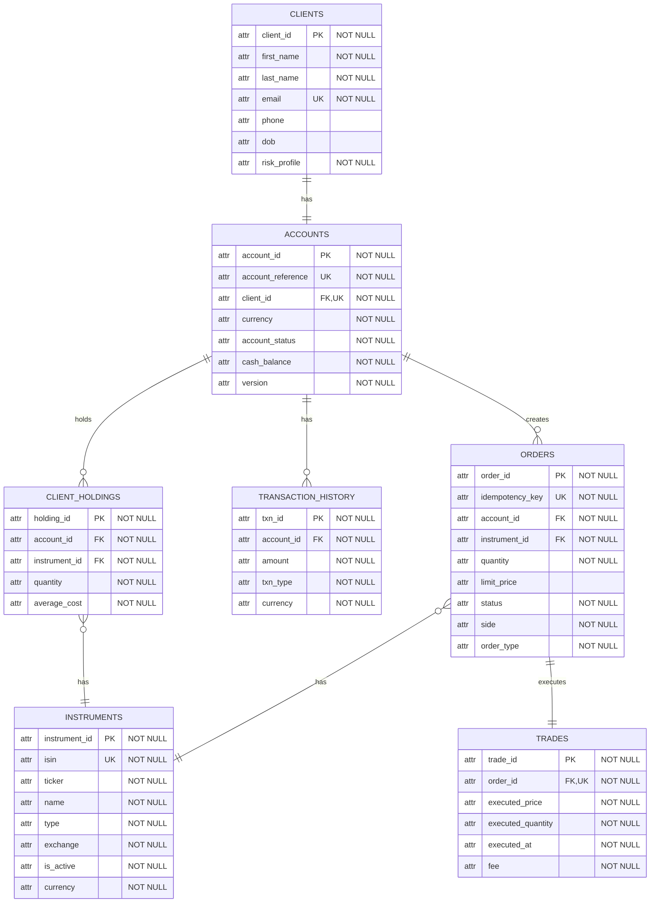

# Trading Platform — Database Schema (v3)

Entity-relationship diagram for the trading platform, generated from the migration files.

## ER Diagram

## Relationships

| Relationship | Notes |
|---|---|
| Client **has** account | `accounts.client_id` is both `FK` and `UNIQUE` — each client has exactly one account. |
| Account **creates** orders | `orders.account_id` FK. A trigger blocks inserts unless the account is `ACTIVE`. |
| Account **has** cash transactions | `transaction_history.account_id` FK |
| Account **holds** client holdings | `client_holdings.account_id` FK |
| Order **has** instrument | `orders.instrument_id` FK |
| Order **executes** trade | `trades.order_id` is both `FK` and `UNIQUE` — each order maps to at most one trade. |
| Client holdings **has** instrument | `client_holdings.instrument_id` FK |

## Constraint legend

- **PK** — primary key
- **FK** — foreign key
- **UK** — unique key
- **NOT NULL** — column cannot be null

